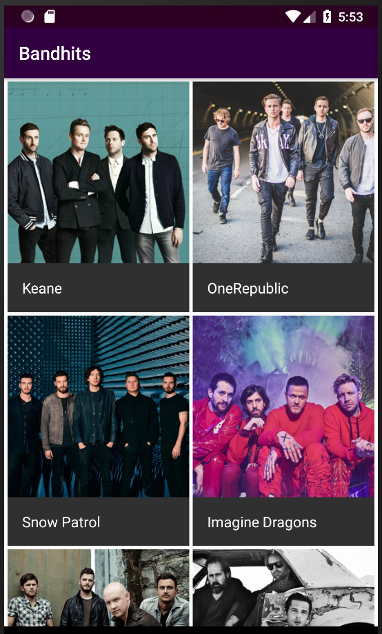

# Bandhits Kotlin

A simple fun project using Kotlin - demonstrating complex architecture connecting to LastFM displaying band and details.

  

## How to use this project

You can use Android Studio or Intellij to work with this repository.

You will need an [API Key from Last.fm](http://www.lastfm.es/api). 

The `Kotlin` plugin for Android Studio is also required.

